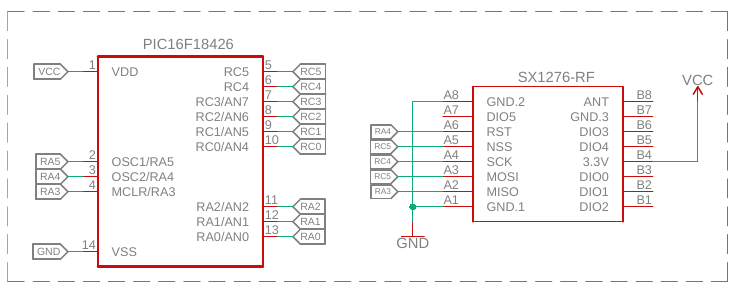

## About The Project

This is the SX1276 LoRa transceiver driver for PIC16F18426. You can use this driver in any microcontroller, you just need to change the SPI driver for your microcontroller.

## Schematic

## Built With
* [PIC16F18426](https://www.microchip.com/wwwproducts/en/PIC16F18426)
* [MPLAP X IDE](https://www.microchip.com/mplab/mplab-x-ide)
* [LoRaWAN](https://lora-alliance.org/)

## IDE and Compiler Version
* [MPLAB XC8 v2.10](https://www.microchip.com/development-tools/pic-and-dspic-downloads-archive)
* [MPLAP X IDE v5.30](https://www.microchip.com/development-tools/pic-and-dspic-downloads-archive)

## Acknowledgements
I used some functionalities implemented in this project: https://github.com/sandeepmistry/arduino-LoRa
